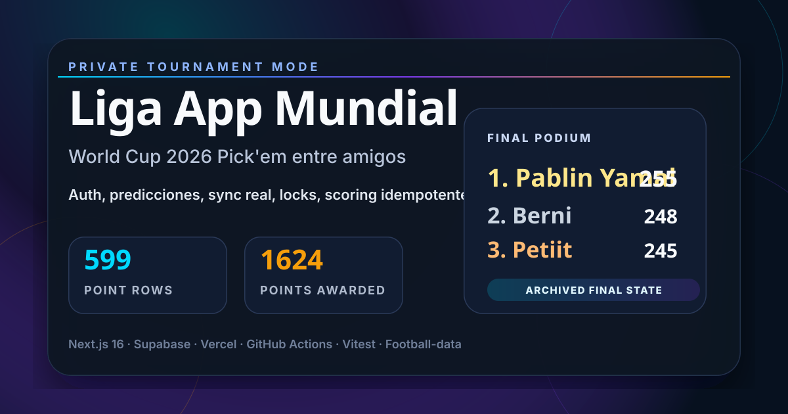

# Liga App Mundial 2026



Private mobile-first Pick'em web app built for a friends league during the
World Cup 2026. The tournament is now closed and this repository is archived as
the final product and operational record.

- Final archive tag: `world-cup-2026-final`
- Production URL during the tournament: `https://app-mundial-sage.vercel.app`
- Final wrap-up: [docs/PROJECT_WRAP_UP_2026.md](docs/PROJECT_WRAP_UP_2026.md)

## Final Result

| Pos | Player | Points |
| ---: | --- | ---: |
| 1 | Pablín Yamal | 255 |
| 2 | Berni | 248 |
| 3 | Petiit | 245 |
| 4 | Patri | 232 |
| 5 | martimessi2022 | 222 |
| 6 | Andrukillo | 198 |
| 7 | Gasti Jump | 176 |
| 8 | Maytte | 48 |

## Project Snapshot

The app supported the full tournament lifecycle: authentication, profile setup,
group predictions, knockout picks, champion picks, live match sync, standings,
locked phases, automatic scoring and a final ranking.

Final production data snapshot:

- 9 profiles
- 48 teams
- 104 synced matches
- 384 group-stage predictions
- 209 knockout predictions
- 2 champion predictions
- 599 scored point rows
- 1624 total points awarded

## Product Analysis

The project worked best as a private-league companion rather than a generic
fantasy platform. The strongest parts were the mobile-first ranking, the
phase-locking model, the scoring idempotency, and the post-incident operational
hardening with critical backups and provenance metadata.

The main operational lesson was that sync jobs must never be allowed to delete
or rewrite user predictions without a rollback artifact and explicit
provenance. After the mid-tournament repair, the app moved to safer sync
behavior, manual recovery traces, protected backups and deterministic
recalculation.

The largest deferred product opportunity is a fully polished post-final
experience: hall of fame, personal recap cards and shareable final results.
Those were intentionally left out once the tournament ended.

## Stack

- Next.js 16 App Router
- TypeScript
- Tailwind CSS v4
- Supabase Auth, PostgreSQL, Storage and RLS
- Football-data provider sync
- Vitest
- GitHub Actions
- Vercel

## Features

- Email/password auth with protected routes.
- Private dashboard with countdowns, next match and ranking position.
- Match calendar with local timezone formatting.
- Group prediction editor with mobile-first navigation.
- Knockout bracket prediction surface.
- Ranking table with podium, avatars and point breakdown.
- Idempotent group, knockout and champion scoring.
- Provider fallback chain and protected sync flow.
- Critical-data backup workflow with JSON/CSV artifacts.
- Prediction provenance for recovered or manually reviewed data.

## Operational Status

This repository is in close-out mode:

- Scheduled sync is disabled.
- Scheduled backup is disabled.
- Production deploy is manual-only.
- Final backup was created locally at
  `backups/critical-data-backup-2026-07-31T16-39-14-978Z`.
- The final operational state is documented in
  [docs/PROJECT_WRAP_UP_2026.md](docs/PROJECT_WRAP_UP_2026.md).

## Local Commands

```bash
pnpm install
pnpm dev
pnpm lint
pnpm test
pnpm build
pnpm backup:critical
pnpm sync
pnpm recalculate-points
```

## Repository Layout

```text
app/                  Next.js App Router routes
components/           UI, layout and World Cup components
lib/                  Supabase clients, services, providers and utilities
scripts/              Backup, sync and scoring scripts
supabase/             Migrations and seed data
tests/                Vitest test suite
docs/                 Product, architecture, audit and close-out docs
.github/workflows/    Manual-only operational workflows
```

## Notes For Future Reuse

This codebase can be reused for another private tournament, but it should start
from a fresh Supabase project and a new provider season. Keep the backup,
provenance and restrict-first sync rules from this version; they were the most
important reliability improvements.
